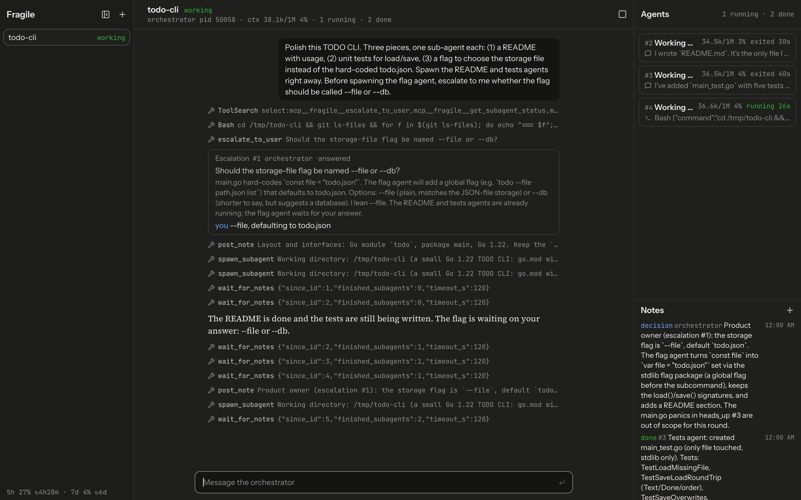
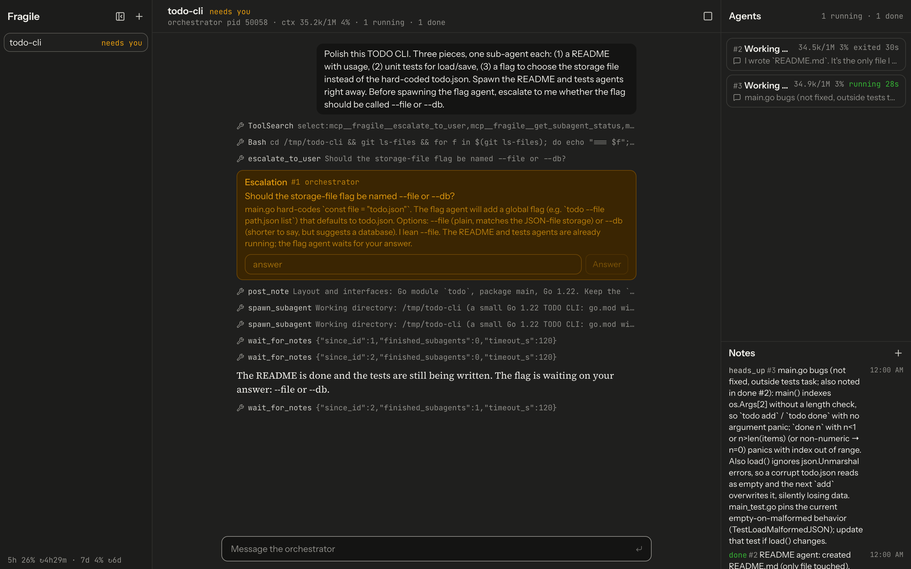
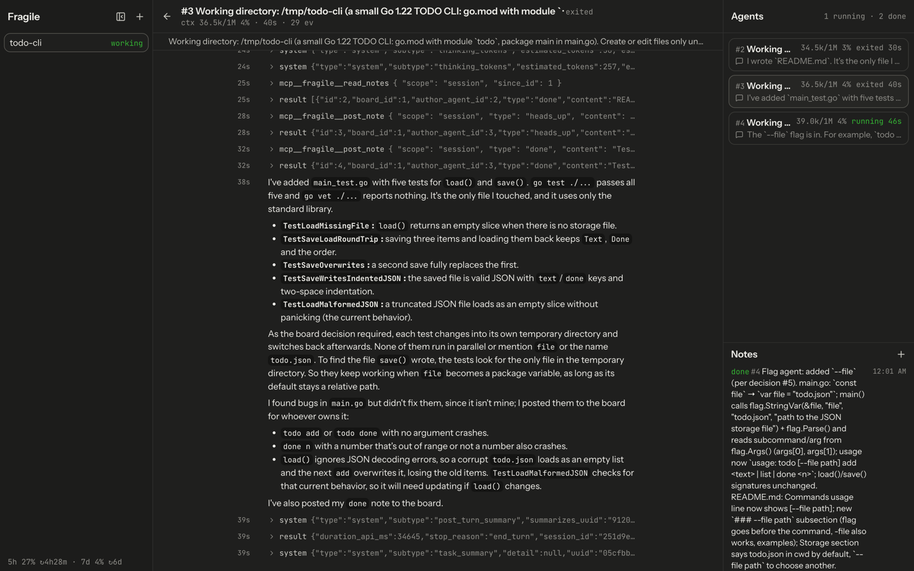
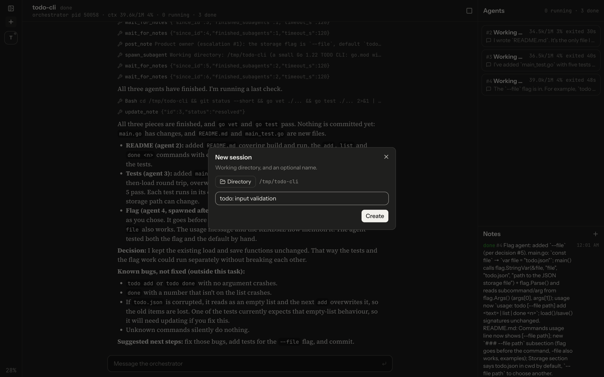

# Fragile

Agile, for agents. A desktop app where an orchestrator Claude Code or Codex agent splits your task across sub-agents that coordinate through a shared notes board. You are the product owner.



## What it does

- **Sessions.** Create one from a folder, with an optional name (default: the folder name). The orchestrator starts on your first message. Sessions run in parallel; reopen past ones (history is in SQLite) or delete them. Status per session: `working`, `done`, `needs you`.
- **Orchestrator chat.** You give the task here. Its text, tool calls and escalations stream in live.
- **Agent cards.** One per sub-agent: task, live status and elapsed time, context usage (`34.5k/1M 3%`), latest output line. Click one for its full output stream (virtualized, view only).
- **Notes board.** The board the agents coordinate through (`decision`, `blocker`, `heads_up`, `done`, `question`). You can add notes and resolve or reopen them.
- **Escalations.** When the orchestrator calls `escalate_to_user`, the session turns `needs you` and the question shows in chat; answer it inline.
- **Subscription limits.** `5h 27% · 7d 4%` at the bottom of the sidebar (reset times on hover), from what `claude` reports.
- **Stop** a session (kills the orchestrator and all its sub-agents).
- **Keyboard-first.** See [shortcuts](#keyboard-shortcuts).

## Screenshots

| | |
|---|---|
|  |  |
| **Needs you:** the orchestrator escalates a naming decision; two sub-agents keep going. | **Agent output:** a sub-agent's full stream, tool calls collapsed. |
|  | |
| **New session** (`⌘N`), with the sidebar collapsed to its rail (`⌘B`). | |

All screenshots are of a real run on a small Go TODO CLI.

## Install

Download the latest `build-N` release from [Releases](https://github.com/Nel-sokchhunly/fragile/releases). CI builds one on every push to `main`.

- **macOS** (`fragile-macos-universal.zip`): the app is unsigned. After unzipping, run once:
  ```bash
  xattr -dr com.apple.quarantine Fragile.app
  ```
- **Linux** (`fragile-linux-amd64.tar.gz`): needs `libgtk-3` and `libwebkit2gtk-4.1`. Agents need `bubblewrap` and `socat` (`apt install bubblewrap socat`); without them a session refuses to start.

Requires your selected provider's CLI on `PATH`, logged in: [`claude`](https://docs.claude.com/en/docs/claude-code) for Claude, [Codex CLI](https://developers.openai.com/codex/cli) for Codex, or Antigravity CLI (`agy`) for Antigravity (setup below). Agents use your existing subscription login; no API key needed.

## Build from source

Needs Go, Node, pnpm and the Wails CLI v2.14.0:

```bash
go install github.com/wailsapp/wails/v2/cmd/wails@v2.14.0
cd app
wails dev     # live-reload window
wails build   # app/build/bin/Fragile.app on macOS
```

On Linux, add `-tags webkit2_41` (`wails build -tags webkit2_41`). `go build ./...` and `go test ./...` work without building the frontend.

Stack: Wails v2 (Go) + React, TypeScript, Tailwind/shadcn, Zustand, react-virtuoso. Backend state reaches the UI only as Wails events into Zustand stores; components never poll.

## Codex with your ChatGPT login

Choose **Codex (ChatGPT)** in the new-session dialog. Install [Codex CLI](https://developers.openai.com/codex/cli) **0.158.0 or later** on the same machine and run `codex login` to sign in with ChatGPT. Fragile uses that CLI's existing credential storage and refresh; it does not ask for an API key, copy login tokens, or implement its own OAuth flow. `CODEX_HOME`, when set, is respected. Missing CLI/login or an unsupported configuration produces a chat error; sign in/update, then retry.

The one-shot notes CLI also accepts `fragile -provider codex -dir /path/to/project "your task"`.

The session's provider is persisted and used by both its orchestrator and all workers. Existing sessions stay on Claude. Codex runs through the CLI's **stdio app-server**: persistent chat turns, Fragile notes/team MCP, escalation answers, text/image input, stop, interrupt, compaction and saved-thread resume. This is not a ChatGPT web-chat wrapper. Codex PDFs are rejected explicitly; send extracted text or images. Model selection is provider-specific: omit `model` for the Codex default, or supply a full Codex model id available to your account; Claude aliases do not cross providers.

**Permissions:** Codex's orchestrator *and* workers are sandboxed, unlike the unsandboxed Claude orchestrator. Named permission profiles allow project/package-cache writes, deny common credentials and Fragile state (including SQLite sidecars and all of CODEX_HOME except installed packages), and proxy command networking through the existing registry/GitHub allowlist. Native delegation, plugins, apps, memory, all lifecycle hooks and web search are disabled; unrelated user/project-configured MCP servers are disabled for the thread. Fragile's role-scoped board/team tools are preapproved; other approval requests are declined, never bypassed. Escalate blocked operations to the user rather than working around the sandbox. Personal CLI configuration/auth remain CLI-owned; administrator requirements may impose further restrictions.

The sidebar's subscription-limit figures currently come from Claude only, not Codex. Codex context usage is displayed when the CLI reports it; Codex cost/subscription-limit telemetry and mixed-provider teams are not implemented. T3 Code's [existing Codex login approach](https://github.com/pingdotgg/t3code/blob/main/docs/user/providers-codex.md) was researched for this integration; no T3 source was copied.

Protocol/worker/lifecycle regression tests run in the normal Go suite. To prove actual OS sandbox enforcement with your installed CLI, without inference or login:

```sh
FRAGILE_CODEX_SMOKE=1 go test ./notes -run TestCodexSandboxSmoke -v
```

For an opt-in end-to-end run using your existing ChatGPT CLI login (and subscription usage), the desktop backend test starts a real sandboxed worker, verifies its file and board note, answers an escalation, interrupts a turn, and stops/resumes the persisted thread:

```sh
FRAGILE_CODEX_E2E=1 go test -tags e2e ./app -run '^TestCodexAppE2E$' -v -timeout 8m
```

This exercises the app API and emitted UI events, not desktop clicks. If `CODEX_HOME` is set, it must select the CLI home where you signed in with ChatGPT.

## Settings

The gear button in the sidebar opens Settings. **Auto-compact at (tokens)** compacts a session's orchestrator (like clicking its context figure) when a turn ends and its context has reached that many tokens. Empty or 0 turns it off (the default); otherwise 20000 to 1000000. It never compacts twice in a row. Settings are stored in the app's database and apply to every session, Claude Code and Codex alike.

## Antigravity (agy) with your Google login

Choose **Antigravity (agy)** in the new-session dialog. Install [Antigravity CLI](https://antigravity.google/docs/cli) (`agy`) on the same machine and log in with your Google Antigravity account. Fragile uses that CLI's existing credential storage; it does not ask for an API key, copy login tokens, or implement its own OAuth flow.

The one-shot notes CLI also accepts:
```bash
fragile -provider agy -dir /path/to/project "your task"
```

The session's provider is persisted and used by both its orchestrator and all workers. Existing sessions stay on their configured provider. Each agent runs `agy --input-format stream-json --output-format stream-json --sandbox` and gets messages on stdin: persistent chat turns, Fragile notes/team MCP, escalation answers, stop, and conversation resume (`--conversation`). Not supported: interrupt (agy has no interrupt message; wait or stop the session), `/compact`, and image/PDF attachments (only the text is sent).

agy reads its configuration only from `~/.gemini`, so Fragile gives every agent its own HOME at `<agent-dir>/agent-N.home`:
- `.gemini/GEMINI.md`: the agent's Fragile prompt, then your own `~/.gemini/GEMINI.md`.
- `.gemini/config/mcp_config.json`: only the Fragile MCP server; `.gemini/config/hooks.json`: denies agy's native sub-agent tools.
- `.gemini/config/config.json`, `.gemini/antigravity` and the entries of `.gemini/antigravity-cli`: links to yours (login, conversations), except `settings.json`, a copy of yours with `permissions.allow` rules added: `command(*)` (run under `--sandbox`), reading and writing the project directory, and the Fragile MCP tools. Headless agy auto-denies anything not allowed; denials show in the chat.

Commands the agents run see that HOME, with `GOPATH`, `XDG_CACHE_HOME` and `GIT_CONFIG_GLOBAL` pointed back at yours unless already set.

**Models:** Model selection is provider-specific: omit `model` for the Antigravity default, or supply a shorthand alias (`flash` = `gemini-3.8-flash-medium`, `pro` = `gemini-3.1-pro-high`, `flash_lite` = `gemini-3.8-flash-low`) or any id from `agy models`. Claude Code aliases (`sonnet`, `opus`, `haiku`) are rejected.

To verify the protocol and the permission rules with your installed Antigravity CLI (runs two short turns on your login):
```sh
FRAGILE_AGY_SMOKE=1 go test ./notes -run TestAGYSandboxSmoke -v
```

For an opt-in end-to-end run using your existing Google Antigravity login:
```sh
FRAGILE_AGY_E2E=1 go test -tags e2e ./app -run '^TestAGYAppE2E$' -v -timeout 8m
```

## Keyboard shortcuts

`⌘` is `Ctrl` on Linux.

| Keys | Action |
|---|---|
| `⌘B` | Collapse / expand the sidebar |
| `⌘K` or `/` | Focus the message box |
| `⌘N` | New session |
| `⌘1`–`⌘9` (`Alt+1`–`Alt+9` on Linux and Windows) | Switch to session 1–9 (the number shown in the sidebar) |
| `Esc` | Interrupt the running turn; in the agent output view, back to chat |
| `⌘⌫` | Delete the current session (asks first) |
| `Enter` / `Shift+Enter` | Send / new line (message box, escalation answer) |
| ``⌘` `` | Toggle the terminal |
| `⌘`+click | Open a link in the terminal |
| `?` | Show all keyboard shortcuts (also the keyboard button in the sidebar) |

## How it works

The details below describe the original Claude runner; the Codex runner's protocol and permission differences are described above.

```
App (Go) ── notes MCP server, 127.0.0.1:<random port>, /mcp/<per-agent token>
 └─ session
     └─ orchestrator   claude -p, long-lived, chat over stdin (stream-json)
         └─ sub-agents claude -p, one process each, started by spawn_subagent
```

- **Notes server.** An MCP server (official Go SDK, streamable HTTP) on loopback only. Each agent gets its own random token in its URL, so every note is attributed to the right agent. Everything is stored in SQLite and appended to `events.jsonl`.
- **Tools per role.** All agents: `read_notes`, `post_note`, `update_note`, `wait_for_notes`. Orchestrator only: `spawn_subagent`, `get_subagent_status`, `escalate_to_user` (hidden from and refused for sub-agents). Sub-agents cannot spawn sub-agents (one level deep).
- **`wait_for_notes(since_id, timeout_s?, type?)`** blocks until a newer note exists (default 60 s, max 120 s), so agents never sleep or poll. The orchestrator can pass `finished_subagents` to also wake when a sub-agent exits. Wake-ups are in-process signals, not DB polling.
- **How the orchestrator waits.** In the app, it does not loop on `wait_for_notes` (each empty return was a full model turn re-reading its context). It ends its turn once sub-agents are running, and the app wakes it with one chat message starting `[Fragile] Board update (automatic, not from the user):` when a sub-agent posts a `done`, `blocker` or `question` note or exits (one line per event, e.g. `#38 done from agent 31: <first line>`, `agent 30 exited (crashed)`). Events within about 2 s are batched; events during a turn wait for the turn to end; events for a stopped orchestrator are dropped (they are on the board). Claude sub-agents in the app wait the same way: they take messages on stdin, and when a turn ends after their `done` note, their stdin is closed and they exit. A turn that ends without one leaves the sub-agent idle: the orchestrator gets `agent 31 idle, waiting (no done note)`, and any note someone else posts wakes the sub-agent with the same kind of message (batched, held while it is mid-turn). The one-shot CLI has no chat input, so its agents keep the `wait_for_notes` loop; so do Codex sub-agents.
- **Agents are headless `claude -p` processes** with `--output-format stream-json`, each in its own process group. Claude Code's built-in sub-agent tools (`Task`, `Agent`, `Workflow`) are disallowed: every sub-agent is a visible process of its own.
- **Orchestrator runs like your own CLI.** No sandbox, your full Claude Code setup (user settings, plugins, hooks, skills, `CLAUDE.md`, memory) and `--permission-mode auto`: Claude Code's classifier runs routine actions and denies risky ones (headless, nothing can prompt), and the orchestrator escalates a denied action it needs to you right away, with the exact command so you can run it yourself. Only the fragile tools are pre-approved, so Bash still goes through the classifier. Your own deny rules apply.
- **Sub-agents load your plugins and skills, but not the rest of your Claude Code setup.** They get your enabled plugins and personal skills (`~/.claude/skills`, as `user:<skill>`) via `--plugin-dir`; plugin hooks run outside the Bash sandbox. Your settings, hooks, `CLAUDE.md` and MCP servers are not loaded (`--setting-sources project`, `--strict-mcp-config`, `CLAUDE_CODE_DISABLE_AUTO_MEMORY=1`); the repo's own `.claude` settings and `CLAUDE.md` still apply. Your `claude` login still works.
- **Bash sandbox (sub-agents).** Every sub-agent runs with Claude Code's built-in sandbox (Seatbelt on macOS, bubblewrap + `socat` on Linux; no unsandboxed fallback). On Ubuntu 24.04+, AppArmor can block bubblewrap; allow it with an AppArmor profile for `bwrap` or `sudo sysctl kernel.apparmor_restrict_unprivileged_userns=0`. Bash can write only under the working directory and package caches (Go, npm, pnpm, cargo, the OS cache dir), cannot read common credentials (`~/.ssh`, `~/.aws`, `gh` and `claude` logins, `~/.netrc`, `~/.docker/config.json`, `~/.kube`) or token env vars, and can reach only package registries and GitHub. The agent dir (tokens, logs), the DB and the event log are hidden from Bash and from Read/Edit/Write, so a sub-agent cannot read the orchestrator's token. When the sandbox blocks something a task needs, the sub-agent posts a `blocker` note and the orchestrator does it outside the sandbox, or escalates to you if it is risky.
- **File tools (sub-agents).** `Edit`/`Write` are allowed only inside the session's working directory (anything else is denied, not prompted). `Read` is not limited to it, but the credential files above, the agent dir, the DB and the event log are denied to Read and Edit.
- **Subscription only.** Agents never receive `ANTHROPIC_API_KEY`, `ANTHROPIC_AUTH_TOKEN`, `ANTHROPIC_BASE_URL` or the Bedrock/Vertex switches, so they always run on your claude.ai login.
- **Model per sub-agent.** The orchestrator picks each sub-agent's model with `spawn_subagent`'s `model` (`sonnet`, `opus`, `haiku` or a full id, passed as `--model`) and is told to save tokens: Sonnet for routine work, Opus only for complex tasks. Omitted, no `--model` is passed and the CLI default is used. The orchestrator always runs on the CLI default.
- **PATH.** On start the app merges your login shell's PATH, so it finds `claude`, node, pnpm and Homebrew tools even when opened from Finder or the Dock.
- **Lifecycle.** At most 8 running sub-agents per session; tasks up to 32 KB. Stopping a session marks agents `stopped`; agents left behind by a force-quit app are killed on the next start. Resume starts a new orchestrator that continues the previous Claude Code conversation (`claude --resume`) after a stop or an app restart; it is told its old sub-agents are gone and to pick up unfinished work.
- **Known limits.** All agents run as your OS user; the orchestrator is unsandboxed and relies on auto mode's classifier; Bash can still read other files outside the working directory; `WebFetch`/`WebSearch` and processes Claude Code starts itself (MCP servers, hooks) are not sandboxed; allowed hosts like github.com can carry data out. See [spec §7](fragile-spec.md#7-known-limitations).
- **Data** lives in `os.UserConfigDir()/Fragile` (`~/Library/Application Support/Fragile` on macOS, `~/.config/Fragile` on Linux): `fragile.db`, `events.jsonl`, `agents/agent-<id>.jsonl` (raw output) and `.mcp.json` configs. Override with `FRAGILE_DATA_DIR`. Deleting a session removes its rows and agent files, never your working directory.
- Prompts: [notes/prompts](notes/prompts).

## Headless CLI

`cmd/fragile` is the Phase 0 experiment runner: the same notes server and agents, no UI.

```bash
go build -o fragile ./cmd/fragile
./fragile -dir /path/to/repo "the task for the orchestrator"
tail -f .fragile/events.jsonl   # watch notes, spawns, escalations
```

It serves notes on `127.0.0.1:7777`, runs the orchestrator in `-dir` and exits when it and all sub-agents are done (Ctrl-C stops everything). Without a task it only serves notes. Escalations are printed, not answerable. Flags: `-addr`, `-dir`, `-db`, `-log`, `-agent-dir` (`./fragile -h`).

## Status

- **Phase 0** (notes server experiment): done. Findings in [docs/phase0-findings.md](docs/phase0-findings.md).
- **Phase 1** (MVP desktop app): done.
- **Phase 2** (v1): next: normal/orchestra toggle, escalation thresholds and inbox, shared/private note scopes, messaging and killing individual sub-agents. See [fragile-spec.md](fragile-spec.md).
- Known limitations: [spec §7](fragile-spec.md#7-known-limitations).
